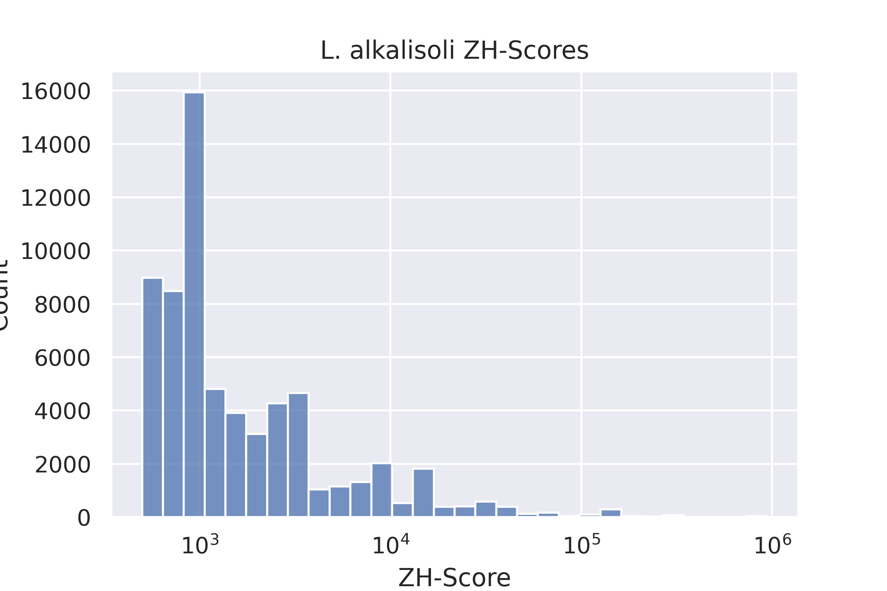

## [Jupyter Notebook](project.ipynb)

## Сводная таблица по Lysobacter
| Название вида | L. alkalisoli | L. antibioticus | L. arenosi | L. capsici | L. caseinilyticus |
| :---: | :---: | :---: | :---: | :---: | :---: |
| Кол-во последовательностей в геноме | 1 | 1 | 1 | 1 | 1 |
| Общая длина последовательностей | 3857091 | 5916388 | 3947892 | 6270417 | 3270651 |
| Количество аннотированных генов | 3429 | 4892 | 3604 | 5200 | 3186 |
| Доля аннотированных генов в геноме | 88.7 | 84.71	 | 90.57 | 83.81 | 92.36 |
| Кол-во участков с ZH-Score > 500 | 64696 | 130767 | 88526 | 179013 | 135193 |
| Общая длина участков с ZH-Score > 500 | 241223 | 462124 | 316891 | 605008 | 455886 |  

## Гистограммы ZH-Score
||
|--|--|
|||
||  |

### Гомологичные кластеры
Найдено 4191 кластера

### 10 выбранных кластеров
Все выбранные кластеры содержат по одному гену на организм (=5 генов).

|Кластер|Функция гена|Расположение Z-DNA относительно промотора|Визуализация|
|--|--|--|--|
| 1 | class I SAM-dependent methyltransferase |Downstream||
| 2 | D-alanyl-D-alanine carboxypeptidase family protein |Downstream||
| 3 | sensor histidine kinase |Downstream||
| 4 | enoyl-CoA hydratase/isomerase family protein |Downstream||
| 5 | TatD family hydrolase |Downstream||
| 6 | UDP-N-acetylmuramate dehydrogenase |Downstream||
| 7 | bifunctional 4-hydroxy-2-oxoglutarate aldolase/2-dehydro-3-deoxy-phosphogluconate aldolase |Downstream||
| 8 | ATP phosphoribosyltransferase |Downstream||
| 9 | dethiobiotin synthase |Downstream||
| 10 | NAD-dependent epimerase/dehydratase family protein |Downstream||

### Белковые выравнивания
|Кластер|Выравнивание|Кластер|Выравнивание|
|--|--|--|--|
| 1 |[выравнивание](clusters/aligned/cluster_1.aln)|6|[выравнивание](clusters/aligned/cluster_6.aln)|
| 2 |[выравнивание](clusters/aligned/cluster_2.aln)|7|[выравнивание](clusters/aligned/cluster_7.aln)|
| 3 |[выравнивание](clusters/aligned/cluster_3.aln)|8|[выравнивание](clusters/aligned/cluster_8.aln)|
| 4 |[выравнивание](clusters/aligned/cluster_4.aln)|9|[выравнивание](clusters/aligned/cluster_9.aln)|
| 5 |[выравнивание](clusters/aligned/cluster_5.aln)|10|[выравнивание](clusters/aligned/cluster_10.aln)|

## Анализ квадруплексов
Отобран 1 кластер

|Кластер|Функция гена|Количество геномов|Визуализация|
|--|--|--|--|
| 1 | polysaccharide deacetylase family protein |4||
